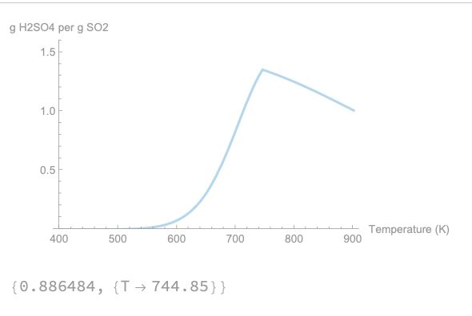

# SkyCatcher

SkyCatcher is a catalytic oxidation reactor for industrial SO2 capture and conversion to sulfuric acid. The device is currently at TRL-4 and has been filed under a provisional patent.

## Models

### SO₂ Conversion Efficiency
Mathematica model of SO₂ conversion kinetics and thermodynamic equilibrium limits for a catalytic oxidation reactor. Plots kinetic conversion (Arrhenius, first-order plug flow), equilibrium ceiling, and effective conversion across 400–900 K, with H2SO4 yield and optimal temperature. Maximum theoretical efficiency attained is 88.6% at ~745 K.

**Stack:** Wolfram Mathematica

### Temperature-Pressure Conversion Map
Python extension of the SO₂ oxidation model, mapping conversion across temperature–pressure space. Integrates Arrhenius kinetics with pressure-based equilibrium to produce a 2D phase diagram over 400–900 K and 0.5–10 atm. Demonstrates the shift from kinetic limitation to equilibrium control, showing that optimal performance emerges as a region in (T, P) space rather than a single operating condition.

**Stack:** Python, Numpy, Matplotlib

